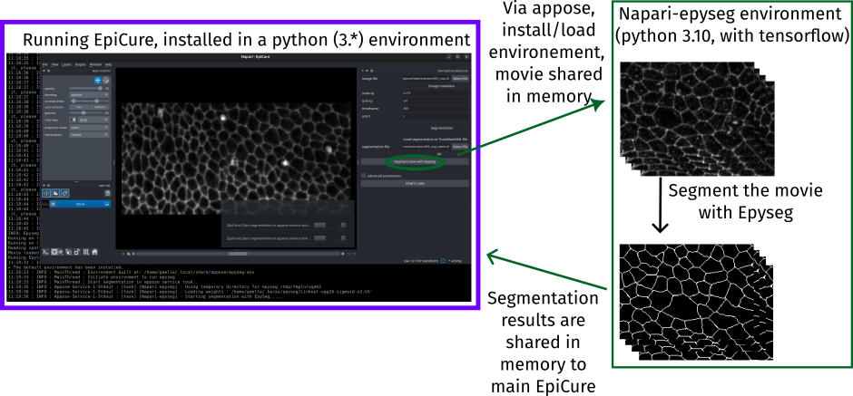

## Segment with EpySeg

When starting EpiCure, once you have selected the movie to process and the junction channel, you have to load the file containing the segmentation of the epithelia movie. If you haven't done it yet, you can use the `Segment now with EpySeg` button that appears in the `Start EpiCure` interface. 

This option uses the [napari-epyseg](https://github.com/gletort/napari-epyseg) plugin to directly run [EpySeg](https://github.com/baigouy/EPySeg) on the movie. It will run with the default parameters. If you want to change some parameters, either use directly the napari-epyseg plugin within Napari (limited number of options) or use the original distribution of EpySeg (you can launch it with `python -m epyseg` in your python environement).

Note that this option depends on dependencies (napari-epyseg and epyseg) that are not initially installed with EpiCure.
Indeed, EpySeg is limited to python 3.10 and relies on tensorflow, which make its installation potentially problematic depending on the OS and python version.
To solve this, we isolated the call to EpySeg to an independant virtual environement, handled entirely automatically by EpiCure thanks to [appose](https://github.com/apposed/appose) library.

When clicking the first time on the `Segment now with EpySeg` button, `appose` will install a new virtual environement with python 3.10, napari-epyseg and tensorflow. 
The next time that the button is clicked, `appose` will simply reuse the same virtual environement.

Then `appose` will put the raw movie to segment in a memory shared between the two python processes (the main EpiCure one and the new napari-epyseg one), and launch the segmentation of this movie in the new virtual environement.
The segmentation will run image by image for the whole movie, on GPU if they are available.
The resulting segmentation will be accessible to the main EpiCure process through the same shared memory space.

Thanks to that set-up, you only have to click on the button and wait for the segmentation to be finished.
Note that it will be slower the first time as the environement will be also installed.
EpiCure will then save the results automatically in the segmentation file default location so that it is ready to use. 
