## A - Correct segmentation and tracking results from TrackMate
This tutorial gives an example on how to correct the segmentation and tracking results obtained after using TrackMate on an epithelia movie.

You can follow it with your own data, or using the test data available in the github repository, selecting the movie [013_crop.tif](https://github.com/Image-Analysis-Hub/Epicure/blob/main/test_data/013_crop.tif) and the corresponding TrackMate file [013_crop_witherrrors.xml](https://github.com/Image-Analysis-Hub/Epicure/blob/main/test_data/013_crop_witherrors.xml).

### A1 - Load the raw movie and TrackMate file

Start Napari, and then EpiCure by going to `Plugins>Epicure>Start epicure`.

A panel opens in the right side, where you can select the raw movie by clicking the `Select file` button on the top right.
Chosse the raw movie (`013_crop.tif`).

The movie is loaded and the metadata are read and displayed in the right panel. 
Check that the extracted values are correct, or change them if necessary.

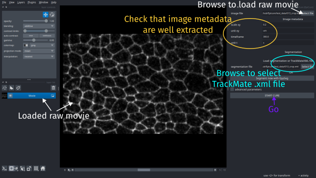

Then to load the TrackMate results, select the `.xml` file (`013_crop_witherrrors.xml`) in the `segmentation_file` parameter of the interface and click on `Start cure`.

The segmentation and tracking information will be loaded. 
The cells are displayed as labels (colors).
Each track correspond to one label (color).

### A2 - Detect potential segmentation or tracking errors

You can navigate through the movie to find segmentation errors, or use the automatic function to highlight potential errors.

For this, go the the `Inspect` tab of the right panel.
In `Track options`, select `Flag track merging`, `Flag track appartion` and `Flag track disparition`.
Select `Ignore cells on: tissue boundaries` at the top of the panel to avoid the border effect and don't check track apparition or disparition for cells at the border. 

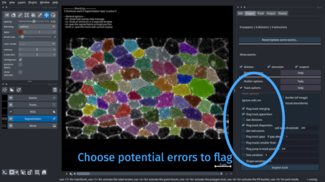

Pontential errors are indicated with white cross on the position of the error, which can be due to segmentation or tracking.

### A3 - Check manually and correct true errors

#### A3a - Navigate through the potential errors
To go through all detected errors, press <kbd>Space</kbd>.
It will move to the position of a first error and zoom on it.
On your Terminal window, a message indicating why this point was flagged has potentially erroneous is printed.
Each time you press <kbd>Space</kbd>, it will go to the next error.

#### A3b - Correct true errors

Go to the two errors at frame 5 toward the bottom of the movie (see figure below).
You can see that the cell present at frame 4 is wrongly splitted in two cells at frame 5 and detected again as one cell in frame 6. 

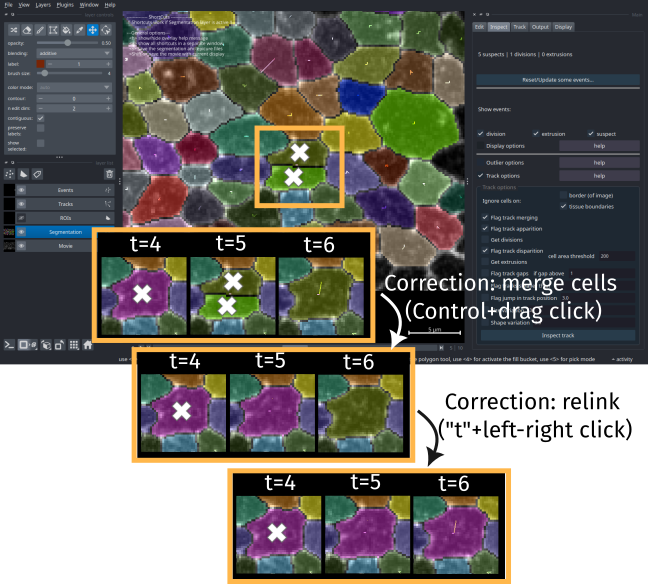

To correct this, at frame 5, press <kbd>Control</kbd> and click with the left mouse button from the first to the second cell to merge together.
The two cells will be merged as one cell, labelled with the previous cell (from frame 4) number as the program tries to automatically relink the cells.

It will also try to relink the cells in the next frame.
Here, you can see that it didn't work and the next frame cell is not linked to the new cell and has another label (color).
To correct, that press <kbd>t</kbd> and do a left click on the cell at frame 5 then a right click on the same cell at frame 6 to link them together.

The error has been corrected.
You can remove the flags by pressing <kbd>Control+Alt</kbd> and right clicking on the cross if you want to clean it while correcting, otherwise you can do all the corrections then inspect again to reset them all and check that all is fine.

## B - Segment, track and measure a tissue

### B1 - Load and segment the raw movie

For this tutorial, you can download the raw movie `015.tif` from the [zenodo repository 7586394](https://zenodo.org/records/7586394) which contains movies of drosophila notum development. 
Click [here to download the movie](https://zenodo.org/records/7586394/files/015.tif?download=1)

Start napari.
Go to `EpiCure>Start EpiCure`.
At the top of the parameter interface at the right side of the napari window, choose the movie to process by clicking `Select file` on the `image file` parameter.
Browse to select the file that you downloaded.

Click `Segment now with EpySeg` to segment it.
!!! warning "Missing dependency"
    To limit EpiCure dependency on other modules, especially Epyseg that is not compatible with recent versions of python, we don't force the installation of `napari-epyseg` with Epicure. If you haven't installed it, you will get an error when trying to use it. In that case, install it (`pip install napari-epyseg`) and start again.

When the segmentation is finished, a file named `015.tif_epyseg.tif` has been saved in the same folder as your movie and is directly proposed as the `segmentation file` in EpiCure interface. 

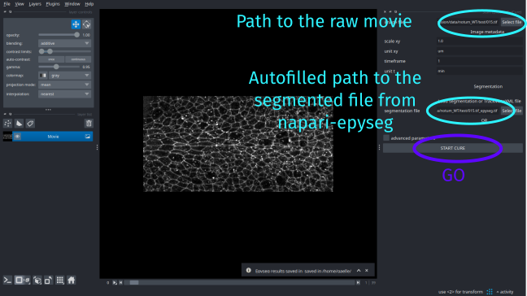

Click `START CURE` to start the process.

### B2 - Track the cells

EpiCure creates cells from the binary segmentation results from EpySeg. 

Press <kbd>Control-C</kbd> two times to display the cells as contours only, and not full colored cell, to see better the signal behind. 

!!! note "The `Segmentation` layer must always be selected in the left panel for the shortcuts to work"

!!! tip "You can save the current display settings in `Display` to use it as default display"
    To save the current display settings (eg cells as contours, not full), go to `Display` panel and click `Set current settings as default`. Now when you open EpiCure it will use these settings as default visualization.

You can see that on the first frame, the segmentation is very bad as the signal is very noisy, but we get good results in all the other frames.
Let's first delete all cells from the first frame to clean the segmenation.

#### B2a - Remove cells from the first frame
Go to the `Edit` panel, and select the `ROI options` interface.
It will expand the interface for this option (ROI=Region Of Interest).
Click `Draw/Select ROI` and select the rectangular selection in the top left panel interface that corresponds to the options linked to the `ROIs` layer.
Draw a rectangle around the all image.

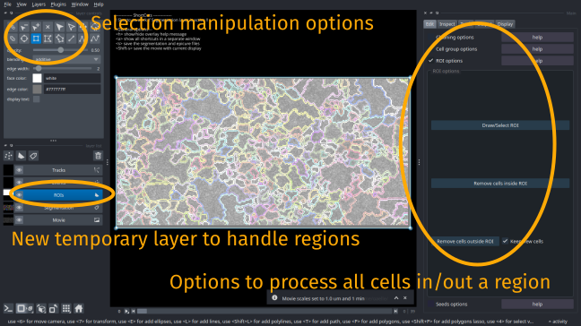

Click `Remove cells inside ROI` to delete all the cells inside the rectangle.
Check that `Segmentation` layer is the currently selected layer again when all cells are removed.
Save the correction by pressing <kbd>s</kbd>.

#### B2b - Track the cells
Select the `Track` panel in the right side interface to choose the options for tracking.

Select `Laptrack-Centroids`.
This option will track the cell by considering the position of their centroids and matching closest points in consecutive frames.

 set `Max distance` to 20, `Splitting cutoff` (division probability) to 0.3 and `Merging cutoff` to 0 (track merging, this should not happen in an epithelia).

Unselect `Add feature cost`.
This could be used to add constraint on the tracking algorithm to try to match cells with similar area or shape in consecutive frames.
It can improve the tracking when cell shapes are close enough from one frame to another. 

Click `Track` to launch the tracking.

!!! note "Set up tracking parameters on a subset of frames"
    You can check the box `Track only some frames` and set the values of `Track from frame` and `Until frame` to perform tracking only on a few frames, to set up the parameters before to track the entire movie.

When the tracking is done, the cells will be colored with a unique color all along the same track.
The `Track` layer shows you the track as lines accross frames.
You can directly show it or hide it by pressing <kbd>r</kbd> when the `Segmentation` layer is selected.

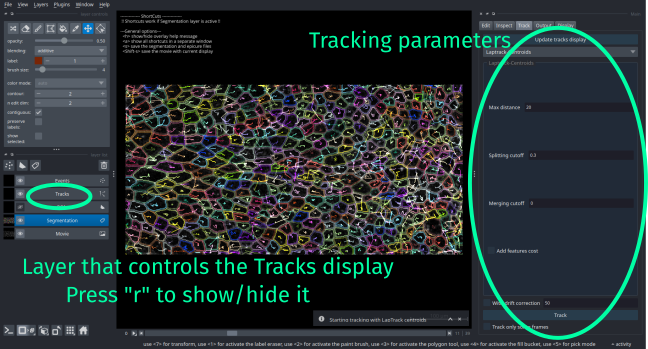

A few divisions should have been detected by the tracking algorithm, you can see them as blue dots.

### B3 - Measure track properties
After doing the tracking, you can inspect and correct eventual segmentation or tracking errors.
When this is done or if you don't need a perfect accuracy for your analysis, you can then perform measurement on the results directly in EpiCure.

To measure track properties, go to `Output` and select `Measure track features`.
Select `All cells` in `Apply on` parameter to measure all tracks at once.
Click `Track features table` to launch the measurement.

A table with one cell/track by row will be displayed in the right-side interface.
Each column is a measured feature, as eg the total length of a track or its average velocity.

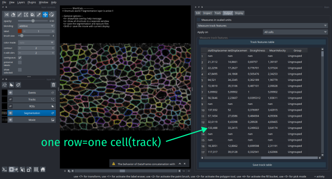

## C - Correct a binary segmentation (skeleton)

This tutorial gives an example on how to load a binary segmentation, track the cells and correct the initial segmentation.

You can follow it with your own data, or using the test data available in the github repository, selecting the movie [area3_Composite.tif](https://github.com/Image-Analysis-Hub/Epicure/blob/main/test_data/area3_Composite.tif) and the corresponding segmentation (binary of the skeleton) [area3_Composite_epyseg.tif](https://github.com/Image-Analysis-Hub/Epicure/blob/main/test_data/area3_Composite_epyseg.tif).

### C1 - Load and track the cells

Start Napari, and then EpiCure by going to `Plugins>Epicure>Start epicure`.

#### C1a - Load raw movie and binary segmentation

A panel opens in the right side, where you can select the raw movie by clicking the `Select file` button on the top right.
Chosse the raw movie (`area3_Composite.tif`).

The movie is loaded and the metadata are read and displayed in the right panel. 
Check that the extracted values are correct, or change them if necessary.

Here, the raw movie is a Composite movie (there are two stainings in the same movie).
Each color channel is loaded as a separated layer in napari, that you can see on the bottom left of the interface.
The layer that will be analysed by EpiCure will be called `Movie` and the other layers are called `MovieChannel_i` where i is the number of the channel in the raw movie.
In this example, the channel that contains the junction staining is the channel `1` and channel `0` (used by default) contains nuclei.
Then, set the parameter `junction_chanel` in the right side interface to `1`, so that the visible layer called `Movie` now contains the correct staining.

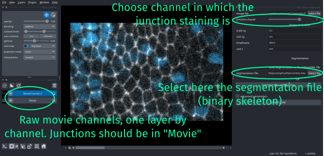

Then to load the segmentation, select the `area3_Composite_epyseg.tif` file in the `segmentation_file` parameter of the interface and click on `Start cure`.

The segmentation (a binary skeleton) will be transformed to a set of full cells, displayed as colors (labels).

#### C2a - Remove border cells

The cell that touch the border of the image are not entirely visible and are often disappearing/appearing and a source of errors.
They can either be ignored in the processing or flag as border cells in the output table, or they can also be removed from the segmentation.

To remove cells that touch the border of the image, go to `Edit` panel and select the `Cleaning options` feature.
You can choose to remove the cells that are less than `x` pixels away from the border, where `x` is 1 by default (touching the border of the image) but could be increased if you want to remove more cells.
Click `Remove border cells` to get rid of these cells.

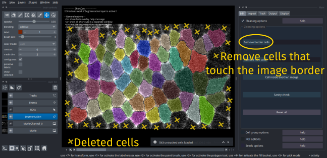

#### C3a - Track cells

To track the cells to help detect segmentation errors, go the `Track` panel and select `Laptrack-Overlaps`.

Set `Min IOU` to 0.1: this controls the minimum overlap between segmented cells from two consevutive frames to be allowed to be linked as the same cells.
Set `Splitting cost` to 0 to don't allow any division and `Merging cost` to 0 to not allow any merging of cells.

Click `Track`.

When it is finished, each cell is colored by its track and the `Tracks` layer contains lines to show the local trajectory of the cell. 
You can show/hide this layer by pressing <kbd>r</kbd>.

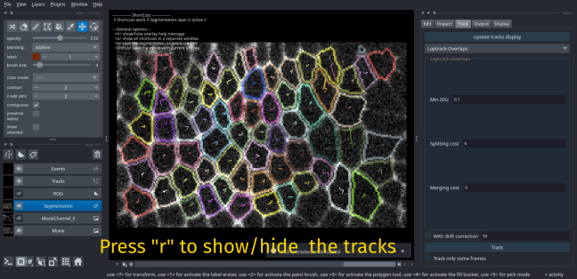

### C2 - Correct segmentation errors

#### C2a - Detect potential errors

To automatically find potential segmentation errors, go the `Inspect` panel.
At this step, there should be no events (no suspects, no division, no extrusion), except if you used different parameters in the Tracking step.

Check the `Track options` feature, and unselect all options if some are selected.

Here, we will detect cell that have a sudden change of size.
For this, check the `Size variation` parameter, and set to `1`, so that cell that have a change of area of at least once their size will be flagged.

Click on `Inspect track`, you should obtain 3 suspects, toward the end of the movie.
Press <kbd>Space</kbd> to navigate through these suspects point: the program will zoom on each suspect and display in the Terminal why each point was flagged as suspect.

#### C2b - Correct wrongly merged cells by splitting

If you check the two first suspects, you can see that they are raised by the same segmentation error that is the wrong segmentation of two cells (at frame 2 and 4) as one cell at frame 3.

To split the cell in two, go to frame 3, press <kbd>Alt</kbd> and by keeping the right button of the mouse clicked, draw the separation line between the two cells.
When you release the mouse button, two cells should apear. 

The central cell should have been correctly relinked with the cell before and after.
The second cell is not correctly relinked as you can see that in frame 3, a very small cell has been detected as this missing cell. 

To unlink it to this track, press <kbd>t</kbd> to switch to track edition. 
Press <kbd>Shift</kbd> and do a right click on the small cell to unlink it to the previous cell and start a new track with this cell.

To now link the second cell that was wrongly linked to this small cell at frame 3, press <kbd>t</kbd> again to go to track edition mode.
Do a left click on the cell at frame 3 to link with the same cell at frame 3 by doing a right click on it.
Do the same to link the cell again from frame 3 to frame 4 (press <kbd>t</kbd> then left and right click on the cell on each frame).

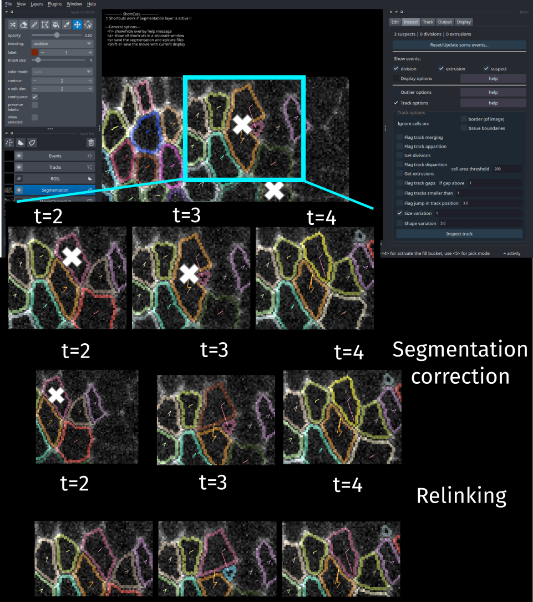

Go to `Track` panel and click on `Update tracks display` to update the `Tracks` layer with the changes made in this correction step.
Remove the corresponding suspects if some are left (should be automatically removed) by pressing <kbd>Control+Alt</kbd> and doing a right click on the suspect point. 

